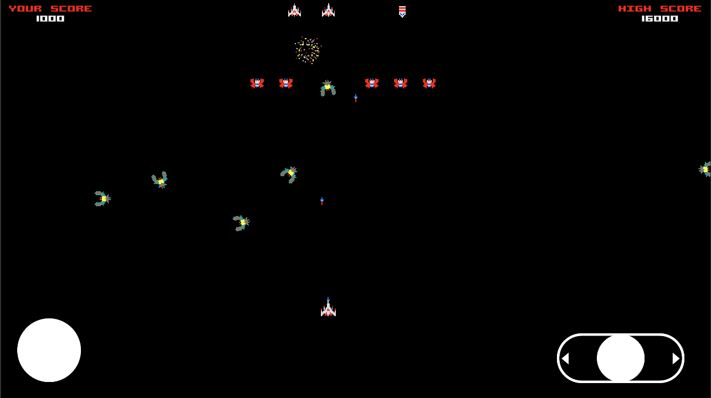
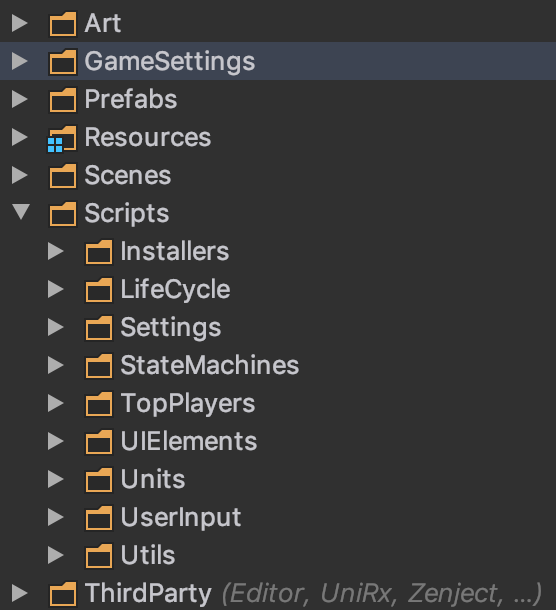
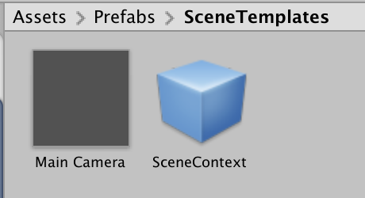
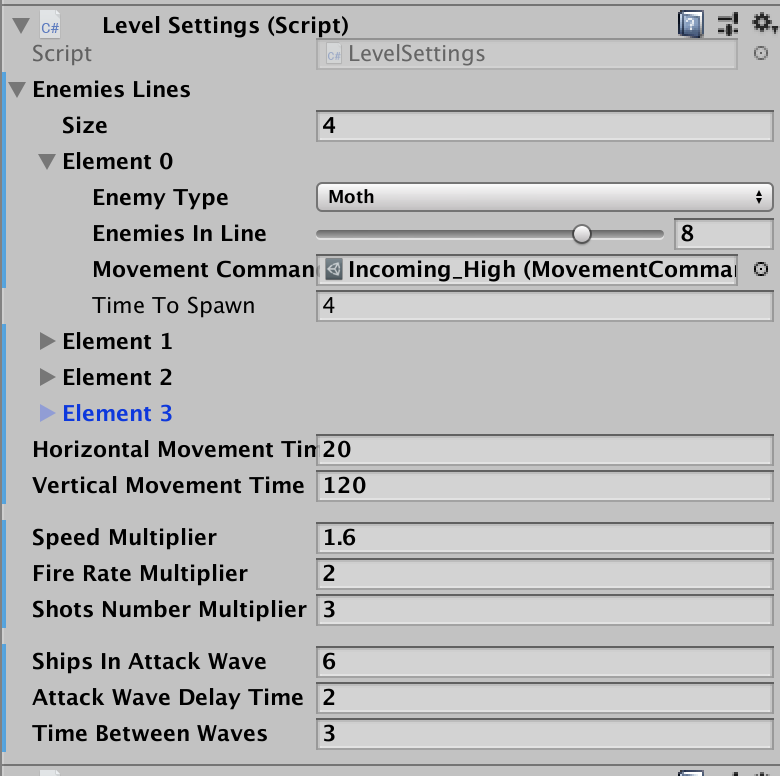

# Galaga Test Project

Test project with Galaga-like game with a focus on application architecture.

Reference: https://www.youtube.com/watch?v=dvjapcHsqXY

This game was created with the main consideration to make it scalable, testable, easy to read and support. Application is based on IoC framework [Zenject](https://github.com/modesttree/Zenject) to support low coupling of game modules. Execution flow of the game is based on a few finite-state machines for each level of game logic: main game life-cycle, level logic and enemies movement.

## Other achieved goals for the game:
* 2D Game with landscape orientation
* Touch base control using an on-screen joystick
* Support multiple levels of enemies with an easy way to create new ones
* Multiple UI menus with UI transitions
* Sound effects
* Easy way to configure the game

## Project structure

* Art - folder with game assets: animations, units, and UI sprites and sounds.
* GameSettings - settings files for player, enemies and levels order setup, and also strategies of enemies movement.
* Prefabs - folder contains prefabs of objects that are required to start the game and are used for all levels, units prefabs, and template prefabs for a new scene.
* Resources - contains only third-party plugin's assets
* Scenes folder contains 5 levels of the game 
* Scripts:
  * Installers - Zenject framework binding collections for Scene and Game context.
  * LifeCycle - finite-state machines, their states, and transitions for the game and level logic
  * Settings - data classes with different game settings, mostly used in installers
  * StateMachines - abstract state machine and it's infrastructure, used in the game and level state machines
  * TopPlayers - highest score repository
  * UIElements - contains totally separated from other logic UI elements: game HUD, on-screen controls, name enter panel and records panel
  * Units - folder with main classes for player and enemies ships, enemy formation controllers and enemy movement logic, and other classes for in-game objects like projectiles 
  * UserInput - contains two ways to control player's ship: with the on-screen joystick and with keyboard for Unity Editor
  * Utils - contains accessory class ObjectsPool

## Used third-party plugins
* [Zenject](https://github.com/modesttree/Zenject) - used for inversion of control and loosely-coupled code architecture
* [UniRx](https://github.com/neuecc/UniRx) - reactive extensions that help to handle game events
* [DOTween](http://dotween.demigiant.com/) - tool used for UI transitions
* [Joystick Pack](https://assetstore.unity.com/packages/tools/input-management/joystick-pack-107631) - required for on-screen joystick
* [SceneReference](https://gist.github.com/JohannesMP/ec7d3f0bcf167dab3d0d3bb480e0e07b) - scenes serialization, used in levels order settings

## Game entry point
Each level contains SceneContext object with `SceneContext` component. After loading of each level, `SceneContext` class will try to initialize `ProjectContext` for dependencies building process with project's installers (if it was not done yet) and then build scene's dependencies using scene's installers.

During project dependencies building process will be created an object with component `GameStarter` which the main purpose is to create and start state machine for the entire game: `GameLifeCycleStateMachine`. All high-flow game logic will be executed in states of this state machine. 

## New level creation
To create a new level you have to create a new empty scene and place there two prefabs:

Now, this scene is fully functional and could be launched immediately or added to other levels in `LevelsOrderInstaller` asset in setting folder.

To change enemies behavior you have to modify `LevelSettings` component on `SceneContext` object:

You can change enemies speed and attack modifiers for this level and setup number of incoming enemies waves. To change the way how they will arrive you can select other command queues in `GameSettings/Movement` folder.
